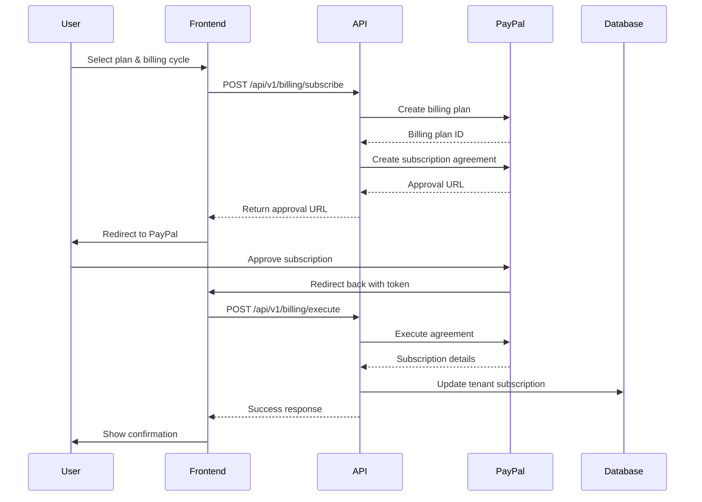

# PayPal Billing System Implementation Plan

## Executive Summary

Comprehensive billing system for DID Optimizer with PayPal integration, featuring tiered subscription plans and per-DID monthly charges. This plan outlines the database schema, API architecture, frontend integration, and automated billing workflows.

---

## 1. Current State Analysis

### Existing Infrastructure
- ✅ **Tenant Model**: Has subscription, limits, billing, and usage tracking fields
- ✅ **Basic Billing Routes**: `/temp_clone/routes/billing.js` with PayPal SDK integration
- ✅ **Frontend UI**: Billing page with pricing tiers and mock data
- ✅ **Dependencies**: `paypal-rest-sdk` v1.8.1 installed

### Gaps Identified
- ❌ No Invoice model for payment tracking and history
- ❌ No per-DID pricing calculation logic
- ❌ Billing routes not connected to main server
- ❌ No automated monthly billing cycle
- ❌ No grace period or account suspension logic
- ❌ Incomplete PayPal webhook handling
- ❌ No email notifications for billing events

---

## 2. Pricing Structure Design

### Base Subscription Tiers

| Tier | Monthly Price | Yearly Price | Key Features |
|------|--------------|--------------|--------------|
| **Basic** | $99/mo | $990/yr (2 months free) | BYO DIDs, Basic rotation rules, Geography-based recommendations, Automated DID purchase |
| **Professional** | $299/mo | $2,990/yr (2 months free) | All Basic features + AI-powered DID rotation, Predictive analytics, Advanced optimization |
| **Enterprise** | Custom | Custom | All Professional features + Custom ML models, White-glove service, Dedicated support |

### Feature Comparison

#### Basic Plan ($99/mo)
- **Bring Your Own DIDs (BYO)**: Import and manage your existing DID inventory
- **Basic Rotation Rules**: Round-robin, least-used, time-based rotation
- **Geography-Based Recommendations**: Daily recommendations for DID purchases based on call traffic patterns by state/area code
- **Automated DID Purchase**: System can automatically purchase recommended DIDs from configured providers (optional)
- **Up to 250 DIDs**: Maximum DID capacity
- **Standard Analytics**: Basic call metrics, success rates, geographic distribution
- **Email Support**: Response within 24 hours
- **Per-DID Overage**: $1.50/DID/month beyond 250 DIDs

#### Professional Plan ($299/mo)
- **All Basic Features**
- **AI-Powered DID Rotation**: Machine learning models optimize DID selection based on:
  - Historical call success rates
  - Time-of-day patterns
  - Customer demographics
  - Geographic performance
  - Carrier reputation scores
- **Predictive Analytics**: Forecast call success rates, identify optimal DIDs
- **Advanced Rotation Algorithms**: Performance-based, AI-recommended, custom rules
- **Up to 1,000 DIDs**: Maximum DID capacity
- **Real-time Optimization**: Continuous learning and adaptation
- **Priority Support**: Response within 4 hours
- **API Webhooks**: Real-time event notifications
- **Per-DID Overage**: $1.00/DID/month beyond 1,000 DIDs

#### Enterprise Plan (Custom Pricing)
- **All Professional Features**
- **Custom ML Models**: Train models on your specific call patterns
- **Unlimited DIDs**: No capacity limits
- **White-Glove Onboarding**: Dedicated implementation team
- **24/7 Dedicated Support**: Phone + Slack channel
- **Custom Integrations**: Tailored API integrations
- **SLA Guarantees**: 99.99% uptime guarantee
- **Quarterly Business Reviews**: Strategic planning sessions
- **Negotiated Per-DID Rates**: Volume discounts available

### Pricing Calculation Formula
```javascript
// Monthly billing calculation
const PRICING_PLANS = {
  basic: {
    name: 'Basic',
    price: 99,
    includedDids: 250,
    perDidCost: 1.50,
    features: ['byo_dids', 'basic_rotation', 'geo_recommendations', 'auto_purchase']
  },
  professional: {
    name: 'Professional',
    price: 299,
    includedDids: 1000,
    perDidCost: 1.00,
    features: ['all_basic', 'ai_rotation', 'predictive_analytics', 'advanced_algorithms']
  },
  enterprise: {
    name: 'Enterprise',
    price: 'custom',
    includedDids: 999999,
    perDidCost: 'custom',
    features: ['all_professional', 'custom_ml', 'unlimited_dids', 'white_glove']
  }
};

// Monthly billing calculation
baseFee = PRICING_PLANS[plan].price
didCount = await DID.countDocuments({ tenantId, isActive: true })
includedDids = PRICING_PLANS[plan].includedDids
extraDids = Math.max(0, didCount - includedDids)
perDidFee = PRICING_PLANS[plan].perDidCost * extraDids
totalAmount = baseFee + perDidFee

// Example: Professional plan with 1,200 DIDs
// baseFee = $299
// didCount = 1,200
// includedDids = 1,000
// extraDids = 200
// perDidFee = 200 × $1.00 = $200
// totalAmount = $299 + $200 = $499
```

### Enterprise Custom Pricing
- Contact sales for quote
- Negotiated base fee and per-DID rate
- Custom limits and features
- Dedicated account manager included

---

## 3. Database Schema Design

### New Invoice Model

```javascript
// models/Invoice.js
const invoiceSchema = new mongoose.Schema({
  invoiceNumber: {
    type: String,
    required: true,
    unique: true
  },
  tenantId: {
    type: mongoose.Schema.Types.ObjectId,
    ref: 'Tenant',
    required: true,
    index: true
  },
  billingPeriod: {
    start: { type: Date, required: true },
    end: { type: Date, required: true }
  },
  subscription: {
    plan: {
      type: String,
      enum: ['starter', 'professional', 'enterprise'],
      required: true
    },
    baseFee: { type: Number, required: true },
    billingCycle: {
      type: String,
      enum: ['monthly', 'yearly'],
      required: true
    }
  },
  didCharges: {
    didCount: { type: Number, required: true, default: 0 },
    includedDids: { type: Number, required: true },
    extraDids: { type: Number, required: true, default: 0 },
    perDidRate: { type: Number, required: true },
    totalDidFee: { type: Number, required: true, default: 0 }
  },
  amounts: {
    subtotal: { type: Number, required: true },
    tax: { type: Number, default: 0 },
    total: { type: Number, required: true }
  },
  status: {
    type: String,
    enum: ['draft', 'pending', 'paid', 'failed', 'refunded', 'cancelled'],
    default: 'draft'
  },
  paymentDetails: {
    provider: {
      type: String,
      enum: ['paypal', 'stripe', 'manual'],
      default: 'paypal'
    },
    transactionId: String,
    paypalOrderId: String,
    paypalSubscriptionId: String,
    paidAt: Date,
    failedAt: Date,
    failureReason: String
  },
  metadata: {
    generatedAt: { type: Date, default: Date.now },
    dueDate: { type: Date, required: true },
    pdfUrl: String,
    emailSentAt: Date,
    notes: String
  }
}, {
  timestamps: true
});

// Indexes
invoiceSchema.index({ invoiceNumber: 1 }, { unique: true });
invoiceSchema.index({ tenantId: 1, createdAt: -1 });
invoiceSchema.index({ status: 1 });
invoiceSchema.index({ 'billingPeriod.start': 1, 'billingPeriod.end': 1 });

// Generate invoice number
invoiceSchema.pre('save', async function(next) {
  if (this.isNew && !this.invoiceNumber) {
    const date = new Date();
    const year = date.getFullYear();
    const month = String(date.getMonth() + 1).padStart(2, '0');
    const count = await this.constructor.countDocuments({
      createdAt: {
        $gte: new Date(year, date.getMonth(), 1),
        $lt: new Date(year, date.getMonth() + 1, 1)
      }
    });
    this.invoiceNumber = `INV-${year}${month}-${String(count + 1).padStart(5, '0')}`;
  }
  next();
});
```

### Updated Tenant Model Fields

```javascript
// Add to existing Tenant model
subscription: {
  // ... existing fields ...
  perDidPricing: {
    enabled: { type: Boolean, default: true },
    customRate: { type: Number, default: null }, // For enterprise custom pricing
  },
  gracePeriod: {
    enabled: { type: Boolean, default: true },
    daysAllowed: { type: Number, default: 7 },
    currentFailedPayments: { type: Number, default: 0 },
    suspendedAt: Date,
    suspensionReason: String
  }
},
billing: {
  // ... existing fields ...
  emailForInvoices: String,
  autoPayEnabled: { type: Boolean, default: true },
  lastInvoiceDate: Date,
  totalPaid: { type: Number, default: 0 },
  totalOutstanding: { type: Number, default: 0 }
}
```

---

## 3.5 PayPal Vaulting for Credit Cards

### Overview
PayPal Vaulting allows secure storage of credit card information without handling sensitive card data directly. Customers without PayPal accounts can pay via credit card, and the system can charge them automatically for recurring subscriptions.

### Why Vaulting?
- ✅ **PCI Compliance**: PayPal handles card storage, reducing PCI scope
- ✅ **Credit Card Support**: Accept payments from customers without PayPal accounts
- ✅ **Recurring Billing**: Charge stored payment methods automatically
- ✅ **Better UX**: Customers enter card details once, not every month
- ✅ **Security**: Tokenized payment methods, no raw card data stored

### PayPal Vaulting Architecture

```javascript
// Payment method storage flow
1. Customer enters card details on frontend
2. PayPal.js tokenizes card → returns vault token
3. Backend stores vault token in database
4. Monthly billing charges the vaulted token
5. PayPal processes charge and returns result
```

### Payment Method Schema Addition

```javascript
// Add to Tenant model
billing: {
  // ... existing fields ...
  paymentMethods: [{
    type: {
      type: String,
      enum: ['paypal_account', 'credit_card', 'debit_card'],
      required: true
    },
    isPrimary: {
      type: Boolean,
      default: false
    },
    vaultId: {
      type: String, // PayPal vault token
      required: true
    },
    last4: String, // Last 4 digits of card
    cardType: String, // visa, mastercard, amex, discover
    expiryMonth: Number,
    expiryYear: Number,
    billingAddress: {
      name: String,
      street: String,
      city: String,
      state: String,
      zipCode: String,
      country: String
    },
    isActive: {
      type: Boolean,
      default: true
    },
    addedAt: {
      type: Date,
      default: Date.now
    },
    lastUsedAt: Date
  }]
}
```

### Vaulting API Flow

#### 1. Frontend: Collect Card Details with PayPal.js

```javascript
// Frontend: temp_clone/frontend/src/pages/Billing.js

// Load PayPal SDK with vault support
useEffect(() => {
  const script = document.createElement('script');
  script.src = `https://www.paypal.com/sdk/js?client-id=${process.env.REACT_APP_PAYPAL_CLIENT_ID}&vault=true&intent=subscription`;
  script.async = true;
  document.body.appendChild(script);
}, []);

// Vault credit card
const vaultCreditCard = async (cardDetails) => {
  try {
    // Create card object
    const response = await fetch('/api/v1/billing/payment-methods/vault', {
      method: 'POST',
      headers: { 'Content-Type': 'application/json' },
      body: JSON.stringify({
        cardNumber: cardDetails.number,
        expiryMonth: cardDetails.expiryMonth,
        expiryYear: cardDetails.expiryYear,
        cvv: cardDetails.cvv,
        billingAddress: cardDetails.billingAddress
      })
    });

    const data = await response.json();

    if (data.success) {
      alert('Payment method added successfully!');
      fetchPaymentMethods(); // Reload payment methods
    }
  } catch (error) {
    console.error('Failed to vault card:', error);
    alert('Failed to add payment method. Please try again.');
  }
};
```

#### 2. Backend: Vault Card with PayPal

```javascript
// routes/billing.js

// @desc    Vault credit card payment method
// @route   POST /api/v1/billing/payment-methods/vault
// @access  Private/Admin
router.post('/payment-methods/vault', requireAdmin, [
  body('cardNumber').notEmpty().withMessage('Card number is required'),
  body('expiryMonth').isInt({ min: 1, max: 12 }).withMessage('Invalid expiry month'),
  body('expiryYear').isInt({ min: new Date().getFullYear() }).withMessage('Invalid expiry year'),
  body('cvv').notEmpty().withMessage('CVV is required'),
  body('billingAddress').notEmpty().withMessage('Billing address is required')
], asyncHandler(async (req, res) => {
  const errors = validationResult(req);
  if (!errors.isEmpty()) {
    throw createError.badRequest(errors.array()[0].msg);
  }

  const { cardNumber, expiryMonth, expiryYear, cvv, billingAddress } = req.body;
  const tenant = await Tenant.findById(req.user.tenantId._id);

  try {
    // Create credit card vault object
    const creditCardData = {
      type: 'CREDIT_CARD',
      number: cardNumber,
      expire_month: expiryMonth,
      expire_year: expiryYear,
      cvv2: cvv,
      first_name: billingAddress.firstName,
      last_name: billingAddress.lastName,
      billing_address: {
        line1: billingAddress.street,
        city: billingAddress.city,
        state: billingAddress.state,
        postal_code: billingAddress.zipCode,
        country_code: billingAddress.country
      }
    };

    // Vault the card with PayPal
    const vaultedCard = await new Promise((resolve, reject) => {
      paypal.creditCard.create(creditCardData, (error, creditCard) => {
        if (error) reject(error);
        else resolve(creditCard);
      });
    });

    // Store vault token in database
    const paymentMethod = {
      type: 'credit_card',
      isPrimary: tenant.billing.paymentMethods.length === 0, // First card is primary
      vaultId: vaultedCard.id,
      last4: cardNumber.slice(-4),
      cardType: vaultedCard.type.toLowerCase(),
      expiryMonth,
      expiryYear,
      billingAddress: {
        name: `${billingAddress.firstName} ${billingAddress.lastName}`,
        street: billingAddress.street,
        city: billingAddress.city,
        state: billingAddress.state,
        zipCode: billingAddress.zipCode,
        country: billingAddress.country
      },
      isActive: true,
      addedAt: new Date()
    };

    tenant.billing.paymentMethods.push(paymentMethod);
    await tenant.save();

    res.json({
      success: true,
      message: 'Payment method added successfully',
      data: {
        paymentMethod: {
          ...paymentMethod,
          vaultId: undefined // Don't expose vault token to frontend
        }
      }
    });

  } catch (error) {
    console.error('Failed to vault credit card:', error);
    throw createError.internal('Failed to add payment method. Please check your card details.');
  }
}));
```

#### 3. Charge Vaulted Payment Method

```javascript
// services/billing/billingService.js

export async function chargeVaultedPaymentMethod(tenant, invoice) {
  // Get primary payment method
  const paymentMethod = tenant.billing.paymentMethods.find(pm => pm.isPrimary && pm.isActive);

  if (!paymentMethod) {
    throw new Error('No active payment method found');
  }

  try {
    if (paymentMethod.type === 'paypal_account') {
      // Charge PayPal account (existing flow)
      return await chargePayPalAccount(tenant, invoice);
    } else {
      // Charge vaulted credit card
      return await chargeVaultedCard(paymentMethod.vaultId, invoice);
    }
  } catch (error) {
    console.error('Payment failed:', error);
    throw error;
  }
}

async function chargeVaultedCard(vaultId, invoice) {
  // Create payment using vaulted card
  const paymentData = {
    intent: 'sale',
    payer: {
      payment_method: 'credit_card',
      funding_instruments: [{
        credit_card_token: {
          credit_card_id: vaultId
        }
      }]
    },
    transactions: [{
      amount: {
        total: invoice.amounts.total.toFixed(2),
        currency: 'USD',
        details: {
          subtotal: invoice.amounts.subtotal.toFixed(2),
          tax: invoice.amounts.tax.toFixed(2)
        }
      },
      description: `Invoice ${invoice.invoiceNumber} - ${invoice.subscription.plan} Plan`,
      invoice_number: invoice.invoiceNumber,
      custom: invoice.tenantId.toString()
    }]
  };

  return new Promise((resolve, reject) => {
    paypal.payment.create(paymentData, (error, payment) => {
      if (error) {
        reject(error);
      } else {
        // Payment successful
        const sale = payment.transactions[0].related_resources[0].sale;
        resolve({
          transactionId: sale.id,
          status: sale.state,
          amount: sale.amount.total
        });
      }
    });
  });
}
```

### Payment Method Management APIs

```javascript
// @desc    Get all payment methods
// @route   GET /api/v1/billing/payment-methods
// @access  Private
router.get('/payment-methods', authenticate, asyncHandler(async (req, res) => {
  const tenant = await Tenant.findById(req.user.tenantId._id);

  // Sanitize payment methods (don't expose vault tokens)
  const sanitizedMethods = tenant.billing.paymentMethods.map(pm => ({
    id: pm._id,
    type: pm.type,
    isPrimary: pm.isPrimary,
    last4: pm.last4,
    cardType: pm.cardType,
    expiryMonth: pm.expiryMonth,
    expiryYear: pm.expiryYear,
    isActive: pm.isActive,
    addedAt: pm.addedAt,
    lastUsedAt: pm.lastUsedAt
  }));

  res.json({
    success: true,
    data: { paymentMethods: sanitizedMethods }
  });
}));

// @desc    Set primary payment method
// @route   PUT /api/v1/billing/payment-methods/:id/primary
// @access  Private/Admin
router.put('/payment-methods/:id/primary', requireAdmin, asyncHandler(async (req, res) => {
  const tenant = await Tenant.findById(req.user.tenantId._id);
  const { id } = req.params;

  // Set all to non-primary
  tenant.billing.paymentMethods.forEach(pm => {
    pm.isPrimary = pm._id.toString() === id;
  });

  await tenant.save();

  res.json({
    success: true,
    message: 'Primary payment method updated'
  });
}));

// @desc    Delete payment method
// @route   DELETE /api/v1/billing/payment-methods/:id
// @access  Private/Admin
router.delete('/payment-methods/:id', requireAdmin, asyncHandler(async (req, res) => {
  const tenant = await Tenant.findById(req.user.tenantId._id);
  const { id } = req.params;

  // Find and deactivate payment method
  const paymentMethod = tenant.billing.paymentMethods.id(id);

  if (!paymentMethod) {
    throw createError.notFound('Payment method not found');
  }

  if (paymentMethod.isPrimary && tenant.billing.paymentMethods.length > 1) {
    throw createError.badRequest('Cannot delete primary payment method. Set another as primary first.');
  }

  // Remove from PayPal vault
  await new Promise((resolve, reject) => {
    paypal.creditCard.delete(paymentMethod.vaultId, (error) => {
      if (error) reject(error);
      else resolve();
    });
  });

  // Remove from database
  paymentMethod.remove();
  await tenant.save();

  res.json({
    success: true,
    message: 'Payment method deleted'
  });
}));
```

### Frontend: Payment Method UI

```javascript
// temp_clone/frontend/src/components/PaymentMethodForm.js

const PaymentMethodForm = ({ onSuccess }) => {
  const [cardDetails, setCardDetails] = useState({
    number: '',
    expiryMonth: '',
    expiryYear: '',
    cvv: '',
    firstName: '',
    lastName: '',
    street: '',
    city: '',
    state: '',
    zipCode: '',
    country: 'US'
  });

  const [loading, setLoading] = useState(false);

  const handleSubmit = async (e) => {
    e.preventDefault();
    setLoading(true);

    try {
      const response = await axios.post('/api/v1/billing/payment-methods/vault', {
        cardNumber: cardDetails.number,
        expiryMonth: cardDetails.expiryMonth,
        expiryYear: cardDetails.expiryYear,
        cvv: cardDetails.cvv,
        billingAddress: {
          firstName: cardDetails.firstName,
          lastName: cardDetails.lastName,
          street: cardDetails.street,
          city: cardDetails.city,
          state: cardDetails.state,
          zipCode: cardDetails.zipCode,
          country: cardDetails.country
        }
      });

      if (response.data.success) {
        onSuccess();
      }
    } catch (error) {
      alert(error.response?.data?.message || 'Failed to add payment method');
    } finally {
      setLoading(false);
    }
  };

  return (
    <form onSubmit={handleSubmit} className="space-y-4">
      <div>
        <label className="block text-sm font-medium mb-1">Card Number</label>
        <input
          type="text"
          value={cardDetails.number}
          onChange={(e) => setCardDetails({ ...cardDetails, number: e.target.value })}
          placeholder="1234 5678 9012 3456"
          maxLength="16"
          className="w-full px-3 py-2 border rounded-lg"
          required
        />
      </div>

      <div className="grid grid-cols-3 gap-4">
        <div>
          <label className="block text-sm font-medium mb-1">Exp Month</label>
          <input
            type="text"
            value={cardDetails.expiryMonth}
            onChange={(e) => setCardDetails({ ...cardDetails, expiryMonth: e.target.value })}
            placeholder="MM"
            maxLength="2"
            className="w-full px-3 py-2 border rounded-lg"
            required
          />
        </div>
        <div>
          <label className="block text-sm font-medium mb-1">Exp Year</label>
          <input
            type="text"
            value={cardDetails.expiryYear}
            onChange={(e) => setCardDetails({ ...cardDetails, expiryYear: e.target.value })}
            placeholder="YYYY"
            maxLength="4"
            className="w-full px-3 py-2 border rounded-lg"
            required
          />
        </div>
        <div>
          <label className="block text-sm font-medium mb-1">CVV</label>
          <input
            type="text"
            value={cardDetails.cvv}
            onChange={(e) => setCardDetails({ ...cardDetails, cvv: e.target.value })}
            placeholder="123"
            maxLength="4"
            className="w-full px-3 py-2 border rounded-lg"
            required
          />
        </div>
      </div>

      <div className="grid grid-cols-2 gap-4">
        <div>
          <label className="block text-sm font-medium mb-1">First Name</label>
          <input
            type="text"
            value={cardDetails.firstName}
            onChange={(e) => setCardDetails({ ...cardDetails, firstName: e.target.value })}
            className="w-full px-3 py-2 border rounded-lg"
            required
          />
        </div>
        <div>
          <label className="block text-sm font-medium mb-1">Last Name</label>
          <input
            type="text"
            value={cardDetails.lastName}
            onChange={(e) => setCardDetails({ ...cardDetails, lastName: e.target.value })}
            className="w-full px-3 py-2 border rounded-lg"
            required
          />
        </div>
      </div>

      {/* Billing Address Fields */}
      <div>
        <label className="block text-sm font-medium mb-1">Street Address</label>
        <input
          type="text"
          value={cardDetails.street}
          onChange={(e) => setCardDetails({ ...cardDetails, street: e.target.value })}
          className="w-full px-3 py-2 border rounded-lg"
          required
        />
      </div>

      <div className="grid grid-cols-3 gap-4">
        <div>
          <label className="block text-sm font-medium mb-1">City</label>
          <input
            type="text"
            value={cardDetails.city}
            onChange={(e) => setCardDetails({ ...cardDetails, city: e.target.value })}
            className="w-full px-3 py-2 border rounded-lg"
            required
          />
        </div>
        <div>
          <label className="block text-sm font-medium mb-1">State</label>
          <input
            type="text"
            value={cardDetails.state}
            onChange={(e) => setCardDetails({ ...cardDetails, state: e.target.value })}
            maxLength="2"
            className="w-full px-3 py-2 border rounded-lg"
            required
          />
        </div>
        <div>
          <label className="block text-sm font-medium mb-1">ZIP Code</label>
          <input
            type="text"
            value={cardDetails.zipCode}
            onChange={(e) => setCardDetails({ ...cardDetails, zipCode: e.target.value })}
            className="w-full px-3 py-2 border rounded-lg"
            required
          />
        </div>
      </div>

      <button
        type="submit"
        disabled={loading}
        className="w-full bg-primary-600 text-white py-3 px-4 rounded-lg font-medium hover:bg-primary-700 disabled:opacity-50"
      >
        {loading ? 'Processing...' : 'Add Payment Method'}
      </button>

      <p className="text-xs text-gray-500 text-center">
        🔒 Your card information is encrypted and securely stored by PayPal. We never see your full card number.
      </p>
    </form>
  );
};
```

### Security Best Practices

1. **Never Log Card Details**: Never log full card numbers or CVVs
2. **Use HTTPS Only**: All payment endpoints must use HTTPS
3. **Vault Token Protection**: Never expose vault tokens to frontend
4. **PCI Compliance**: By using PayPal vaulting, you reduce PCI scope
5. **Card Validation**: Validate card details before sending to PayPal
6. **Rate Limiting**: Limit payment method addition attempts

### Testing Vaulting

**PayPal Sandbox Test Cards:**
```
Visa: 4111111111111111
Mastercard: 5555555555554444
Amex: 378282246310005
Discover: 6011111111111117

Expiry: Any future date (e.g., 12/2028)
CVV: Any 3-4 digits (e.g., 123)
```

## 4. API Architecture

### 4.1 Billing Routes Enhancement

**New/Updated Endpoints:**

#### Subscription Management
```javascript
POST   /api/v1/billing/subscribe           // Create subscription with PayPal
POST   /api/v1/billing/execute             // Complete PayPal subscription
PUT    /api/v1/billing/subscription/plan   // Change plan
DELETE /api/v1/billing/subscription        // Cancel subscription
GET    /api/v1/billing/subscription        // Get current subscription details
```

#### Invoice Management
```javascript
GET    /api/v1/billing/invoices            // List all invoices (paginated)
GET    /api/v1/billing/invoices/:id        // Get specific invoice
GET    /api/v1/billing/invoices/:id/pdf    // Download invoice PDF
POST   /api/v1/billing/invoices/:id/pay    // Manual payment
POST   /api/v1/billing/invoices/:id/retry  // Retry failed payment
```

#### Payment Method Management (Vaulting)
```javascript
GET    /api/v1/billing/payment-methods                // List all payment methods
POST   /api/v1/billing/payment-methods/vault         // Vault new credit card
PUT    /api/v1/billing/payment-methods/:id/primary   // Set as primary
DELETE /api/v1/billing/payment-methods/:id           // Delete payment method
POST   /api/v1/billing/payment-methods/paypal        // Link PayPal account
```

#### Pricing Information
```javascript
GET    /api/v1/billing/pricing             // Get all pricing plans
POST   /api/v1/billing/estimate            // Calculate estimated cost
GET    /api/v1/billing/usage               // Current billing period usage
```

#### Webhooks
```javascript
POST   /api/v1/billing/webhook/paypal      // PayPal IPN/webhook handler
```

### 4.2 PayPal Integration Architecture

**PayPal Subscription Flow:**



**Per-DID Billing Integration:**

Since PayPal subscriptions are fixed-amount, we'll use a hybrid approach:
1. Base subscription via PayPal recurring billing
2. Per-DID charges calculated monthly and sent as separate invoice
3. OR: Update PayPal subscription amount each month (requires re-approval)

**Recommended Approach: Metered Billing via PayPal Advanced**

```javascript
// Monthly billing cycle job
async function processMonthlyBilling(tenant) {
  // 1. Count active DIDs
  const didCount = await DID.countDocuments({
    tenantId: tenant._id,
    isActive: true
  });

  // 2. Calculate charges
  const plan = PRICING_PLANS[tenant.subscription.plan];
  const extraDids = Math.max(0, didCount - plan.includedDids);
  const perDidFee = extraDids * plan.perDidRate;
  const totalAmount = plan.baseFee + perDidFee;

  // 3. Create invoice
  const invoice = await Invoice.create({
    tenantId: tenant._id,
    subscription: {
      plan: tenant.subscription.plan,
      baseFee: plan.baseFee,
      billingCycle: tenant.subscription.billingCycle
    },
    didCharges: {
      didCount,
      includedDids: plan.includedDids,
      extraDids,
      perDidRate: plan.perDidRate,
      totalDidFee: perDidFee
    },
    amounts: {
      subtotal: totalAmount,
      tax: calculateTax(totalAmount, tenant.billing.address),
      total: totalAmount + tax
    },
    status: 'pending',
    metadata: {
      dueDate: new Date(Date.now() + 7 * 24 * 60 * 60 * 1000) // 7 days
    }
  });

  // 4. Charge via PayPal
  if (tenant.billing.autoPayEnabled && tenant.subscription.paypalSubscriptionId) {
    await chargePayPalInvoice(invoice, tenant);
  }

  // 5. Send invoice email
  await sendInvoiceEmail(invoice, tenant);

  return invoice;
}
```

---

## 5. Automated Billing Workflows

### 5.1 Monthly Billing Job

**Cron Schedule:** Run on 1st of each month at 2:00 AM UTC

```javascript
// services/billing/monthlyBilling.js
import cron from 'node-cron';
import Tenant from '../models/Tenant.js';
import { processMonthlyBilling } from './billingService.js';

// Run at 2 AM on the 1st of every month
cron.schedule('0 2 1 * *', async () => {
  console.log('🔄 Starting monthly billing cycle...');

  const tenants = await Tenant.find({
    isActive: true,
    'subscription.status': { $in: ['active', 'trial'] }
  });

  for (const tenant of tenants) {
    try {
      // Check if trial ended
      if (tenant.subscription.status === 'trial' &&
          tenant.subscription.trialEndsAt < new Date()) {
        console.log(`⚠️ Trial ended for ${tenant.name}, skipping billing`);
        tenant.subscription.status = 'suspended';
        tenant.subscription.gracePeriod.suspendedAt = new Date();
        tenant.subscription.gracePeriod.suspensionReason = 'trial_ended';
        await tenant.save();
        continue;
      }

      if (tenant.subscription.status === 'active') {
        await processMonthlyBilling(tenant);
        console.log(`✅ Billed ${tenant.name} successfully`);
      }
    } catch (error) {
      console.error(`❌ Failed to bill ${tenant.name}:`, error);
      await handleBillingFailure(tenant, error);
    }
  }

  console.log('✅ Monthly billing cycle completed');
});
```

### 5.2 Payment Retry Logic

**Retry Schedule:**
- Immediate retry after 24 hours
- Second retry after 3 days
- Third retry after 7 days
- Suspend account after 3 failed attempts

```javascript
// services/billing/retryPayments.js
import cron from 'node-cron';
import Invoice from '../models/Invoice.js';

// Run daily at 3 AM to retry failed payments
cron.schedule('0 3 * * *', async () => {
  const failedInvoices = await Invoice.find({
    status: 'failed',
    'paymentDetails.failedAt': {
      $gte: new Date(Date.now() - 24 * 60 * 60 * 1000) // Last 24 hours
    }
  }).populate('tenantId');

  for (const invoice of failedInvoices) {
    const tenant = invoice.tenantId;
    const daysSinceFailed = Math.floor(
      (Date.now() - invoice.paymentDetails.failedAt) / (24 * 60 * 60 * 1000)
    );

    // Retry logic: Day 1, 3, 7
    if ([1, 3, 7].includes(daysSinceFailed)) {
      try {
        await retryPayment(invoice, tenant);
        console.log(`✅ Retry successful for invoice ${invoice.invoiceNumber}`);
      } catch (error) {
        console.error(`❌ Retry failed for invoice ${invoice.invoiceNumber}`);

        // Suspend after 3 failed attempts
        if (daysSinceFailed >= 7) {
          await suspendAccount(tenant, 'payment_failed');
        }
      }
    }
  }
});
```

### 5.3 Grace Period & Suspension

**Grace Period Logic:**
```javascript
async function handleBillingFailure(tenant, error) {
  tenant.subscription.gracePeriod.currentFailedPayments += 1;

  if (tenant.subscription.gracePeriod.currentFailedPayments >= 3) {
    // Suspend account after 3 failures
    tenant.subscription.status = 'suspended';
    tenant.subscription.gracePeriod.suspendedAt = new Date();
    tenant.subscription.gracePeriod.suspensionReason = 'payment_failed';
    tenant.isActive = false;

    await tenant.save();

    // Send suspension email
    await sendAccountSuspendedEmail(tenant);

    console.log(`🚫 Account suspended for ${tenant.name} due to failed payments`);
  } else {
    // Still in grace period
    await sendPaymentFailedEmail(tenant, {
      attemptsRemaining: 3 - tenant.subscription.gracePeriod.currentFailedPayments,
      gracePeriodEnds: new Date(Date.now() + 7 * 24 * 60 * 60 * 1000)
    });
  }
}

async function suspendAccount(tenant, reason) {
  tenant.subscription.status = 'suspended';
  tenant.subscription.gracePeriod.suspendedAt = new Date();
  tenant.subscription.gracePeriod.suspensionReason = reason;
  tenant.isActive = false;
  await tenant.save();
  await sendAccountSuspendedEmail(tenant);
}
```

---

## 6. PayPal Webhook Handler

### Webhook Event Types to Handle

```javascript
// routes/billing.js - Enhanced webhook handler
router.post('/webhook/paypal', express.raw({ type: 'application/json' }), async (req, res) => {
  try {
    // Verify webhook signature (important for security)
    const isValid = await verifyPayPalWebhook(req);

    if (!isValid) {
      console.error('❌ Invalid PayPal webhook signature');
      return res.status(401).json({ error: 'Invalid signature' });
    }

    const event = req.body;
    console.log('📨 PayPal Webhook:', event.event_type);

    switch (event.event_type) {
      case 'BILLING.SUBSCRIPTION.ACTIVATED':
        await handleSubscriptionActivated(event);
        break;

      case 'BILLING.SUBSCRIPTION.CANCELLED':
        await handleSubscriptionCancelled(event);
        break;

      case 'PAYMENT.SALE.COMPLETED':
        await handlePaymentCompleted(event);
        break;

      case 'PAYMENT.SALE.DENIED':
      case 'PAYMENT.SALE.REFUNDED':
        await handlePaymentFailed(event);
        break;

      default:
        console.log('ℹ️ Unhandled webhook event:', event.event_type);
    }

    res.status(200).json({ received: true });
  } catch (error) {
    console.error('❌ Webhook processing error:', error);
    res.status(500).json({ error: 'Webhook processing failed' });
  }
});

async function verifyPayPalWebhook(req) {
  // Use PayPal SDK to verify webhook signature
  // This ensures the request actually came from PayPal
  const webhookId = process.env.PAYPAL_WEBHOOK_ID;
  const headers = req.headers;
  const body = req.body;

  return new Promise((resolve, reject) => {
    paypal.notification.webhookEvent.verify(headers, body, webhookId, (error, response) => {
      if (error) {
        reject(error);
      } else {
        resolve(response.verification_status === 'SUCCESS');
      }
    });
  });
}
```

---

## 7. Email Notifications

### Email Templates Needed

1. **Invoice Generated** - New invoice created
2. **Payment Successful** - Payment processed successfully
3. **Payment Failed** - Payment attempt failed
4. **Payment Reminder** - Invoice due in 3 days
5. **Account Suspended** - Account suspended due to non-payment
6. **Subscription Cancelled** - Subscription cancelled
7. **Plan Changed** - Subscription plan upgraded/downgraded

### Implementation with Resend

```javascript
// services/email/billingEmails.js
import { Resend } from 'resend';

const resend = new Resend(process.env.RESEND_API_KEY);

export async function sendInvoiceEmail(invoice, tenant) {
  const emailTo = tenant.billing.emailForInvoices || tenant.users[0].email;

  await resend.emails.send({
    from: 'billing@dids.amdy.io',
    to: emailTo,
    subject: `Invoice ${invoice.invoiceNumber} - DID Optimizer`,
    html: renderInvoiceTemplate(invoice, tenant)
  });
}

export async function sendPaymentSuccessEmail(invoice, tenant) {
  const emailTo = tenant.billing.emailForInvoices || tenant.users[0].email;

  await resend.emails.send({
    from: 'billing@dids.amdy.io',
    to: emailTo,
    subject: `Payment Received - Invoice ${invoice.invoiceNumber}`,
    html: renderPaymentSuccessTemplate(invoice, tenant)
  });
}

export async function sendAccountSuspendedEmail(tenant) {
  const emailTo = tenant.billing.emailForInvoices || tenant.users[0].email;

  await resend.emails.send({
    from: 'billing@dids.amdy.io',
    to: emailTo,
    subject: '🚨 Account Suspended - Payment Required',
    html: renderSuspensionTemplate(tenant)
  });
}
```

---

## 8. Frontend Integration

### 8.1 Update Billing.js Component

**Key Changes:**
```javascript
// temp_clone/frontend/src/pages/Billing.js

// Add real API calls instead of mock data
const fetchBillingData = async () => {
  try {
    const [subscriptionRes, invoicesRes, usageRes] = await Promise.all([
      axios.get('/api/v1/billing/subscription'),
      axios.get('/api/v1/billing/invoices'),
      axios.get('/api/v1/billing/usage')
    ]);

    setSubscription(subscriptionRes.data.data);
    setBillingHistory(invoicesRes.data.data.invoices);
    setUsage(usageRes.data.data);
  } catch (error) {
    console.error('Failed to fetch billing data:', error);
  }
};

// Show per-DID pricing details
const renderDidPricing = () => {
  const { didCount, includedDids, extraDids, perDidRate, totalDidFee } = usage;

  return (
    <div className="bg-white rounded-lg shadow-sm p-6">
      <h3 className="text-lg font-semibold mb-4">DID Usage This Month</h3>

      <div className="space-y-3">
        <div className="flex justify-between">
          <span>Active DIDs</span>
          <span className="font-medium">{didCount}</span>
        </div>

        <div className="flex justify-between">
          <span>Included in Plan</span>
          <span className="font-medium">{includedDids}</span>
        </div>

        {extraDids > 0 && (
          <>
            <div className="border-t pt-3 flex justify-between">
              <span>Additional DIDs</span>
              <span className="font-medium">{extraDids}</span>
            </div>

            <div className="flex justify-between text-sm text-gray-600">
              <span>Rate per DID</span>
              <span>${perDidRate.toFixed(2)}/month</span>
            </div>

            <div className="border-t pt-3 flex justify-between font-semibold">
              <span>Additional DID Charges</span>
              <span className="text-primary-600">${totalDidFee.toFixed(2)}</span>
            </div>
          </>
        )}
      </div>
    </div>
  );
};
```

### 8.2 Add Usage Estimate Calculator

```javascript
// Component to show estimated next invoice
const EstimatedInvoice = ({ currentDids, plan }) => {
  const [estimatedCost, setEstimatedCost] = useState(null);

  useEffect(() => {
    const fetchEstimate = async () => {
      const res = await axios.post('/api/v1/billing/estimate', {
        plan,
        didCount: currentDids
      });
      setEstimatedCost(res.data.data);
    };

    fetchEstimate();
  }, [currentDids, plan]);

  return (
    <div className="bg-blue-50 border border-blue-200 rounded-lg p-4">
      <h4 className="font-semibold mb-2">Estimated Next Invoice</h4>
      <div className="text-2xl font-bold text-primary-600">
        ${estimatedCost?.total.toFixed(2)}
      </div>
      <p className="text-sm text-gray-600 mt-1">
        Based on {currentDids} active DIDs
      </p>
    </div>
  );
};
```

---

## 9. Implementation Checklist

### Phase 1: Database & Models (Week 1)
- [ ] Create Invoice model (`models/Invoice.js`)
- [ ] Update Tenant model with new billing fields
- [ ] Add payment methods array to Tenant model (for vaulting)
- [ ] Add feature flags to Tenant (for Basic vs Professional features)
- [ ] Add database indexes for performance
- [ ] Create migration script for existing tenants
- [ ] Test model validation and methods

### Phase 2: Backend API (Week 2)
- [ ] Enhance billing routes with per-DID pricing logic
- [ ] Implement invoice generation service
- [ ] Add usage tracking endpoints
- [ ] Create estimate calculator API
- [ ] Implement PayPal subscription flow
- [ ] **Implement PayPal vaulting for credit cards**
- [ ] Add payment method management endpoints (list, add, delete, set primary)
- [ ] Integrate vaulted payment charging in billing service
- [ ] Add comprehensive error handling
- [ ] Write unit tests for billing logic and vaulting

### Phase 3: Automated Jobs (Week 3)
- [ ] Create monthly billing cron job
- [ ] Implement payment retry logic
- [ ] Add grace period handling
- [ ] Create account suspension workflow
- [ ] Add usage tracking middleware
- [ ] Test cron jobs thoroughly

### Phase 4: Webhooks & Email (Week 4)
- [ ] Implement PayPal webhook handler
- [ ] Add webhook signature verification
- [ ] Create email templates (Handlebars)
- [ ] Integrate with Resend for email sending
- [ ] Add email queue for reliability
- [ ] Test all webhook scenarios

### Phase 5: Frontend Integration (Week 5)
- [ ] Update Billing.js with real API calls
- [ ] Add per-DID pricing display
- [ ] Create usage estimate calculator
- [ ] Add invoice download functionality
- [ ] Implement plan change workflow
- [ ] **Create PaymentMethodForm component for credit card entry**
- [ ] **Add payment method management UI (list, add, delete, set primary)**
- [ ] **Integrate PayPal.js for vaulting**
- [ ] Add loading states and error handling
- [ ] Test all user flows (PayPal and credit card)

### Phase 6: Testing & Documentation (Week 6)
- [ ] End-to-end testing with PayPal sandbox
- [ ] Load testing for billing jobs
- [ ] Security audit of payment flow
- [ ] Create admin documentation
- [ ] Create user-facing billing guide
- [ ] Prepare for production deployment

### Phase 7: Production Deployment (Week 7)
- [ ] Configure production PayPal credentials
- [ ] Set up webhook endpoints in PayPal dashboard
- [ ] Configure cron jobs on production server
- [ ] Set up monitoring and alerting
- [ ] Deploy to production
- [ ] Monitor first billing cycle

---

## 10. Environment Variables

### Required .env Variables

```bash
# PayPal Configuration
PAYPAL_MODE=sandbox # 'sandbox' for testing, 'live' for production
PAYPAL_CLIENT_ID=your_paypal_client_id
PAYPAL_CLIENT_SECRET=your_paypal_client_secret
PAYPAL_WEBHOOK_ID=your_webhook_id

# Email Configuration (Resend)
RESEND_API_KEY=your_resend_api_key
BILLING_EMAIL_FROM=billing@dids.amdy.io

# Application URLs
FRONTEND_URL=https://dids.amdy.io
API_URL=https://dids.amdy.io

# Billing Settings
BILLING_GRACE_PERIOD_DAYS=7
BILLING_RETRY_ATTEMPTS=3
BILLING_INVOICE_DUE_DAYS=7
```

---

## 11. Testing Strategy

### Unit Tests
- Pricing calculation logic
- Invoice generation
- Grace period logic
- Webhook event handlers

### Integration Tests
- PayPal subscription flow
- Payment processing
- Email delivery
- Database operations

### E2E Tests
- Complete signup and subscription flow
- Plan upgrades/downgrades
- Payment failure and retry
- Account suspension and reactivation

### Load Tests
- Monthly billing job performance (1000+ tenants)
- Concurrent payment processing
- API response times under load

---

## 12. Monitoring & Alerts

### Key Metrics to Track
- Monthly Recurring Revenue (MRR)
- Churn rate
- Failed payment rate
- Average revenue per user (ARPU)
- DID usage trends

### Alerts to Configure
- Billing job failures
- High payment failure rate
- PayPal webhook failures
- Email delivery failures
- Account suspensions

### Logging Requirements
- All payment transactions
- Plan changes
- Invoice generation
- Webhook events
- Failed payments

---

## 13. Security Considerations

### Payment Security
- ✅ Never store PayPal credentials on client
- ✅ Verify webhook signatures
- ✅ Use HTTPS for all payment endpoints
- ✅ Implement rate limiting on billing APIs
- ✅ Log all payment transactions

### Data Protection
- ✅ Encrypt sensitive billing data at rest
- ✅ PCI DSS compliance (PayPal handles card data)
- ✅ Audit trail for all billing changes
- ✅ Role-based access control for billing admin

### Fraud Prevention
- ✅ Monitor for unusual DID count spikes
- ✅ Detect and prevent subscription abuse
- ✅ Implement velocity checks on plan changes
- ✅ Flag accounts with repeated payment failures

---

## 14. Migration Strategy

### For Existing Tenants

1. **Data Migration Script:**
```javascript
// scripts/migrateBilling.js
async function migrateTenants() {
  const tenants = await Tenant.find({});

  for (const tenant of tenants) {
    // Add new billing fields with defaults
    tenant.subscription.perDidPricing = {
      enabled: true,
      customRate: null
    };

    tenant.subscription.gracePeriod = {
      enabled: true,
      daysAllowed: 7,
      currentFailedPayments: 0
    };

    tenant.billing.autoPayEnabled = true;
    tenant.billing.totalPaid = 0;
    tenant.billing.totalOutstanding = 0;

    await tenant.save();
  }

  console.log(`✅ Migrated ${tenants.length} tenants`);
}
```

2. **Backfill Historical Invoices (Optional):**
- Generate invoices for past 6 months based on usage history
- Mark as 'paid' for existing customers
- Helps with reporting and analytics

3. **Communication Plan:**
- Email all customers 30 days before per-DID pricing starts
- Provide detailed pricing breakdown
- Offer migration assistance for enterprise customers

---

## 15. Future Enhancements

### Phase 2 Features (Post-Launch)
- [ ] Annual discount codes
- [ ] Referral program with billing credits
- [ ] Volume discounts for high-DID users
- [ ] Multi-currency support
- [ ] Invoice customization (branding, line items)
- [ ] Usage-based alerts (80%, 90%, 100% of limit)
- [ ] Billing analytics dashboard for admins
- [ ] Automated dunning management
- [ ] Payment method alternatives (Stripe, credit card)
- [ ] Tax calculation automation (TaxJar integration)

---

## 16. Success Metrics

### Technical Metrics
- 99.9% billing job success rate
- < 5% payment failure rate
- < 2 second API response time for billing endpoints
- Zero data breaches or security incidents

### Business Metrics
- 30% of users on paid plans within 3 months
- < 5% monthly churn rate
- Average DID count growth of 15% month-over-month
- 90%+ customer satisfaction with billing system

---

## 17. Support & Documentation

### User-Facing Documentation
- Billing FAQ
- How to upgrade/downgrade plans
- Understanding your invoice
- Payment troubleshooting guide

### Admin Documentation
- Billing system architecture
- How to handle failed payments manually
- How to issue refunds
- How to adjust billing for enterprise customers

### API Documentation
- Billing API endpoints
- Webhook event types
- Error codes and handling

---

## Conclusion

This comprehensive billing system will provide:
- ✅ Automated monthly billing with per-DID charges
- ✅ Multiple subscription tiers with clear pricing
- ✅ Reliable PayPal integration
- ✅ Automated retry and grace period handling
- ✅ Complete invoice history and PDF generation
- ✅ Email notifications for all billing events
- ✅ Secure and compliant payment processing

Estimated implementation time: **6-7 weeks** with 1 full-time developer.

---

**Next Steps:**
1. Review and approve this plan
2. Set up PayPal sandbox account for testing
3. Begin Phase 1: Database & Models implementation
4. Schedule weekly progress reviews
